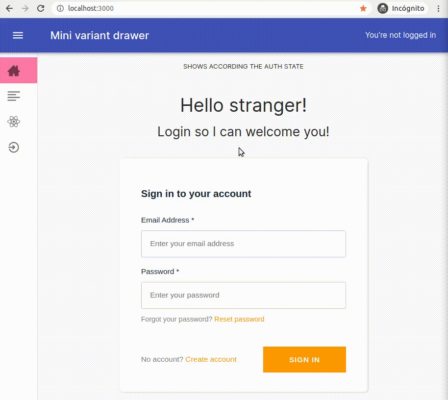

<h1 align="center">React using Cognito authentication 👮 </h1>
<p>
  
  <a href="#" target="_blank">
    
  </a>
</p>

### Description

In repo [react-starter branch auth0](https://github.com/s4nt14go/react-starter/tree/auth0) I showed how can be used [Auth0](https://auth0.com) for authentication. In the case you prefer [AWS Cognito](https://aws.amazon.com/cognito) you can check here how can be done.<br />
### ✨ [Check the demo site](https://react-cognito.netlify.app)<br />
Features:
* [AWS Amplify](https://aws.amazon.com/amplify) to comunicate with Cognito
* `AmplifyAuthenticator` component from library `@aws-amplify/ui-react`
* `React.useContext` to hold authentication state and data<br />
* Components `AuthenticatedRoute` and `UnauthenticatedRoute` protect routes according user authentication state
* Redirect: If an unauthenticated user tries to go to an `AuthenticatedRoute`, first is directed to login and once logged in, it redirects to the intended page<br /><br />
   
<br /><br />

If you want to try this on your side, you will need to deploy your Conigto user and identity pool (I will try to make another repo with this too if I have the time). Once that is deployed you will need to set their values in your `.env.local` file:
```bash
REACT_APP_STAGE=dev
REACT_APP_dev_COGNITO_REGION=<your_data>
REACT_APP_dev_COGNITO_USER_POOL_ID=<your_data>
REACT_APP_dev_COGNITO_APP_CLIENT_ID=<your_data>
REACT_APP_dev_COGNITO_IDENTITY_POOL_ID=<your_data>
```
