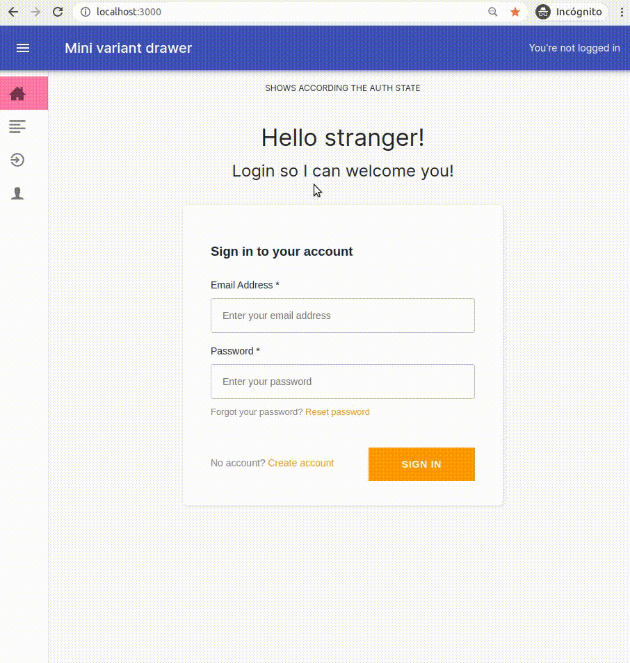

<h1 align="center">React using Cognito authentication 👮 </h1>
<a href="https://app.netlify.com/sites/react-cognito/deploys">
  
</a>

### Description

In repo [react-starter branch auth0](https://github.com/s4nt14go/react-starter/tree/auth0) I showed how can be used [Auth0](https://auth0.com) for authentication. In the case you prefer [AWS Cognito](https://aws.amazon.com/cognito) you can check here how can be done.<br />
### ✨ [Check the demo site](https://react-cognito.netlify.app)<br />
Features:
* [AWS Amplify](https://aws.amazon.com/amplify) to comunicate with Cognito
* `AmplifyAuthenticator` component from library `@aws-amplify/ui-react`
* `React.useContext` to hold authentication state and data<br />
* Components `AuthenticatedRoute` and `UnauthenticatedRoute` protect routes according user authentication state
* Redirect: If an unauthenticated user tries to go to an `AuthenticatedRoute`, first is directed to login and once logged in, it redirects to the intended page<br /><br />
   
<br /><br />

#### Instructions

1. Use Node 14 version, using [nvm](https://github.com/nvm-sh/nvm) you can:

    ```
    # set Node 14 in current terminal
    nvm use 14
    # set Node 14 as default (new terminals will use 14)
    nvm alias default 14
    ```

1. Install dependencies

    ```shell script
    npm ci
    ```

1. Deploy your Cognito user and identity pool `dev` stage as in this [repo](https://github.com/s4nt14go/react-cognito-back). Once that is deployed you will need to set their values in your `.env.local` file:
    
   ```bash
    REACT_APP_STAGE=dev
    REACT_APP_dev_COGNITO_REGION=<your_data>
    REACT_APP_dev_COGNITO_USER_POOL_ID=<your_data>
    REACT_APP_dev_COGNITO_APP_CLIENT_ID=<your_data>
    REACT_APP_dev_COGNITO_IDENTITY_POOL_ID=<your_data>
    ```
    > In the case you change these env vars, you have to restart your React server and refresh the page in order to have them refreshed.

1. Run the app

    ```shell script 
    npm start
    ```
